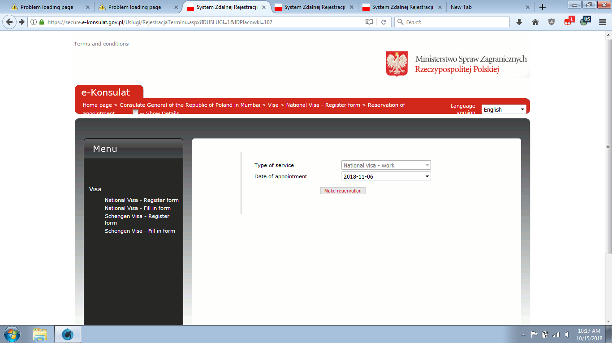
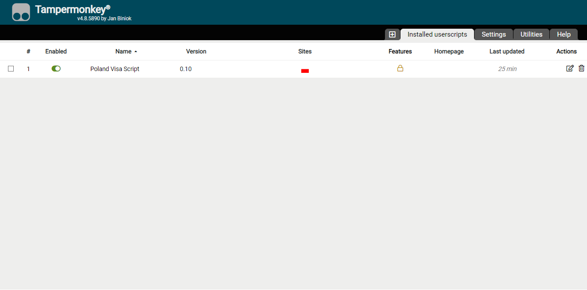
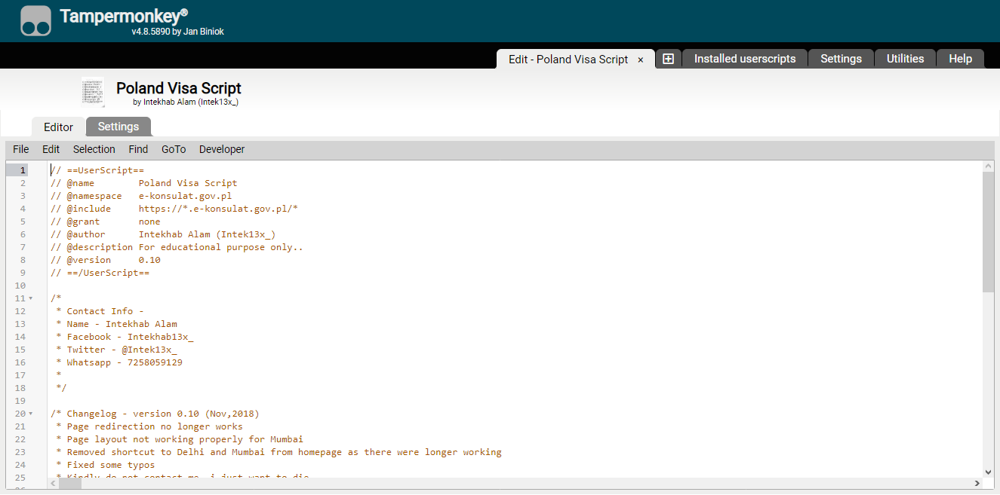
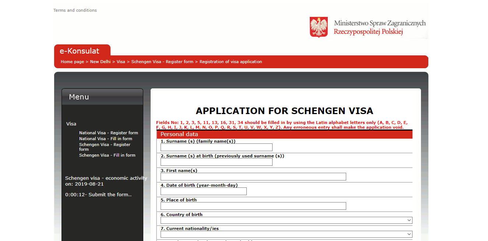
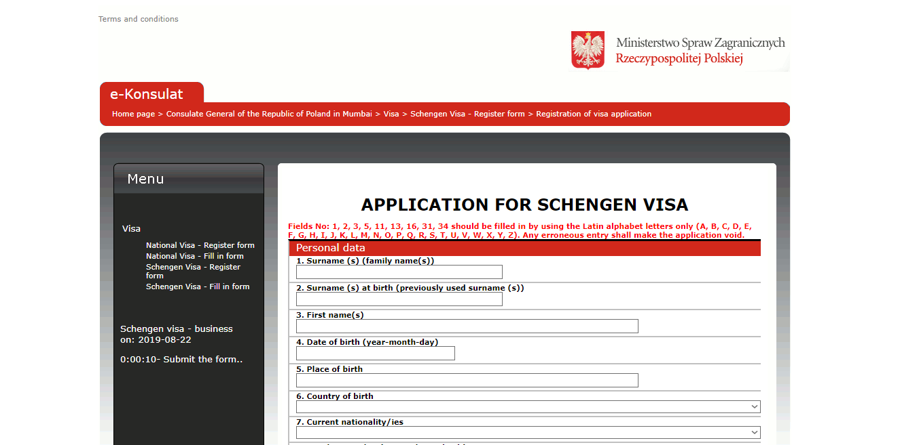
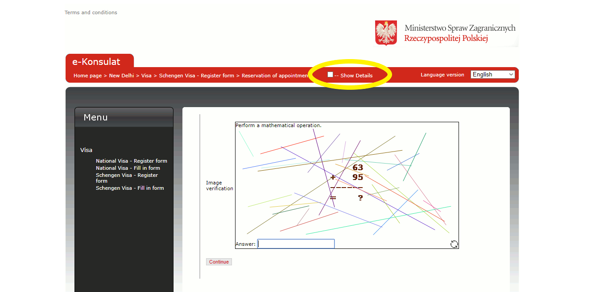
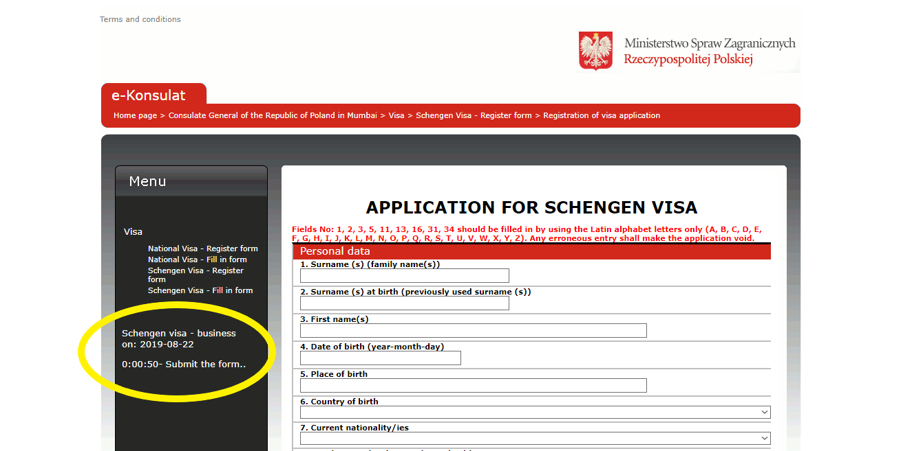

# PolandVisaScript
> Automation script for secure2.e-konsulat.gov.pl 

This script can help you automate the visa appointment booking process to some extent. Use this demo version or contact me to get full version. 

## Installation

PC / Laptop or Android Phone :
 - Install [tampermonkey](https://www.tampermonkey.net/) addon in your browser (firefox or chrome are recommended) 
 - Download this repo and open PolandVisaScript.js in notepad(or any text editor)
 - Open tampermonkey dashboard > add new script > copy-paste the contents of "PolandVisaScript.js"  > save 
   
 - Done, that's all you have to do. Now goto secure2.e-konsulat.gov.pl and try to book appointment in usual way.

## Demo and Proof
Due to high demand and lack of National Visa category dates we are presenting you a demo on other categories, this script will work fine on any category and type. 
Try it out yourself.

**New Delhi**
Category - Schengen Visa 
Type - Economic Activity  

**Mumbai**
Category - Schengen Visa 
Type - Business

## Features 
 - Removes unnecessary info on captcha page 
  
 - Auto selects the available date 
 - Displays counter on left side which shows important info like Visa category, visa type, date of appointment and a time counter on form filling page 
 
 - Shows reminder alert on form page when there is only 15 minutes left to submit
 
### Features available in full version 
 - Ability to pre-select visa category (useful for National work or student category) 
 - Ability to pre-select date range (from specific date to week to month range) 
 - In-built calculator for captcha 
 - Autofill form data
 - Custom country/city shortcut on homepage so you don't have select country and city every time 
 - In-built browser cache and cookie cleaner 
 - Custom VPN with the best servers configured 
 - No more Recaptha errors (coming in future) 
 - Automatic captcha solver (coming in future) 
 
 
## Release History

* 0.10
    * Page redirection no longer works 
    * Page layout not working properly for Mumbai
    * Removed shortcuts to Delhi and Mumbai from homepage
    * Removed unused broken functions
    * Fixed some bugs and syntax errors
 
* 0.07
    * Available on internet, has lots of bugs and unused functions
* earlier versions
    * Not Found!

## Note 
This script is based on some other guy's script who abandoned this project long ago.
This is just a demo version of full script. To get the full script contact us. 

## Warning!  

 -  We are not responsible if you abuse this script on website. You can go to jail if you are not careful. 
 - Also it's not our fault if your shitty e-konsulat site is vulnerable to this simple hack. Authorities can go fuck themselves. 
